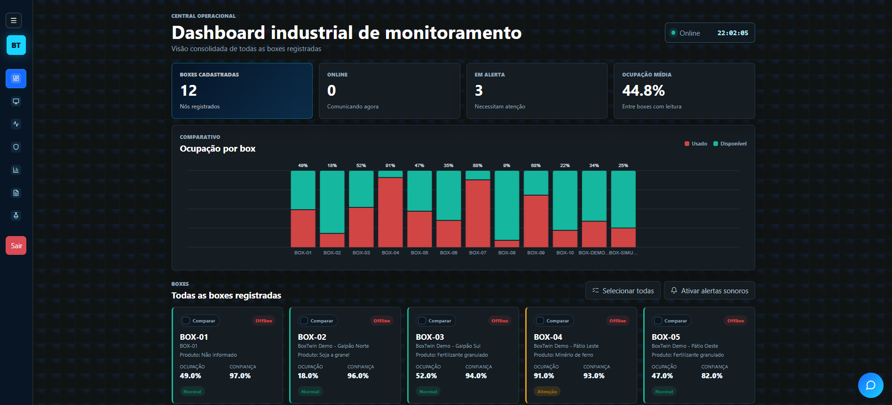
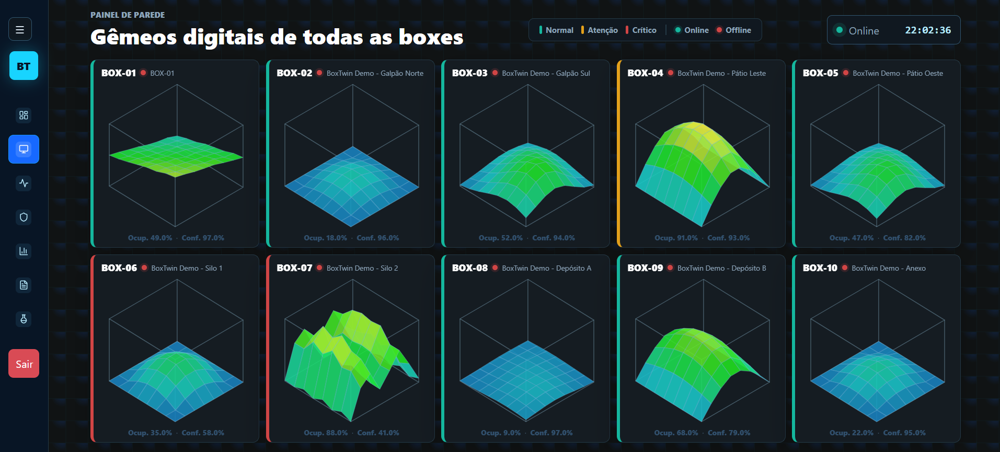
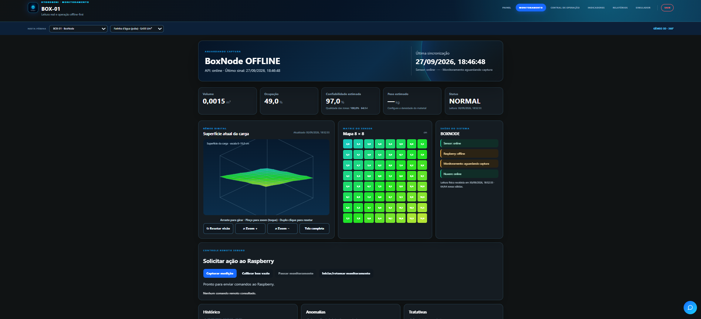
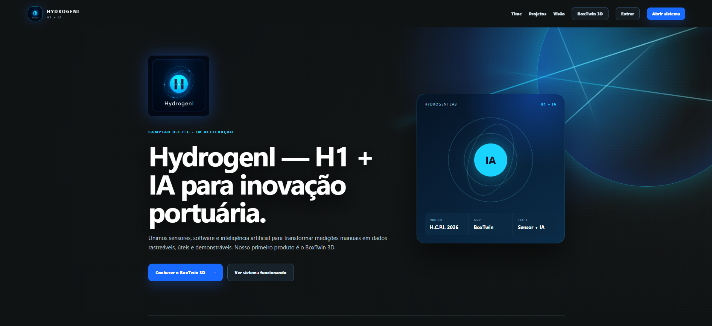

# 🏭 HydrogenI BoxTwin 3D

**Gêmeo digital para medição automática do volume de fertilizantes armazenados em boxes portuários.**

🏆 **Vencedor do Desafio 3 — II Hackathon do Complexo Portuário do Itaqui (2026)**
Realização: EMAP · ICT Guará

🔗 **Sistema em produção:** [hydrogeni-boxtwin-production.up.railway.app](https://hydrogeni-boxtwin-production.up.railway.app)

> 🔒 O código-fonte é privado e de propriedade da equipe HydrogenI. Este repositório apresenta o projeto e a equipe responsável por ele.

---

## 🎯 O problema

No Porto do Itaqui, o controle de estoque de fertilizantes armazenados em boxes depende de **estimativas visuais e contagens manuais**. Não há medição automatizada do volume de carga em cada box, o que gera imprecisão no inventário e exige inspeção humana constante.

## 💡 A solução

O **BoxTwin** cria um **gêmeo digital 3D** de cada box:

1. Um **sensor de profundidade** instalado sobre o box mede a superfície da carga.
2. Um **Raspberry Pi** processa as leituras localmente, calcula volume, ocupação e peso estimado, e guarda tudo mesmo **sem internet**.
3. Quando há conexão, os dados são **sincronizados com a nuvem**, onde ficam disponíveis os painéis, alertas e relatórios.

```text
Box → sensor 8×8 → Raspberry Pi (edge) → cálculo volumétrico → SQLite + fila offline
                                                              ↓
                              Nuvem (Railway) ← sincronização ← internet disponível
                                     ↓
                     painéis 3D · alertas · e-mail/WhatsApp · relatórios
```

## 📸 Telas

| Visão geral de todas as boxes | Painel de parede |
|---|---|
|  |  |

| Monitoramento com gêmeo 3D | Página pública |
|---|---|
|  |  |

## ✨ Principais funcionalidades

- **Gêmeo digital 3D** da superfície da carga e mapa de alturas
- **Volume, ocupação, alturas e peso estimado** por tipo de material
- **Painel geral** com todas as boxes e comparação entre gêmeos 3D
- **Painel de parede** para centrais de operação
- **Alertas** de capacidade, baixa confiança do sensor e possível obstrução, com confirmação humana e histórico de tratativas
- **Notificações** por e-mail e WhatsApp, com regras de escalonamento
- **Relatórios** operacionais em PDF e Excel
- **Operação offline** no Raspberry com sincronização idempotente para a nuvem
- **Assistente com IA** para apoio à operação
- **Simulador público** para demonstração, isolado dos dados reais
- Interface **responsiva** e instalável como **PWA**

## 🛠️ Stack

| Camada | Tecnologias |
|---|---|
| Back-end | Python, Flask, Gunicorn |
| Banco de dados | SQLite (edge e nuvem) |
| Front-end | HTML, CSS, JavaScript |
| Hardware | Raspberry Pi, sensor ToF VL53L8CX (matriz 8×8) |
| Integrações | Resend (e-mail), Twilio (WhatsApp), Groq (IA) |
| DevOps | GitHub Actions (CI), Railway (CD), systemd |

## 👨‍💻 Contribuição de Mateus Mendes

> 🚧 Projeto em desenvolvimento ativo: atualmente na fase de aceleração, rumo ao piloto no Porto do Itaqui.

Atuo no desenvolvimento do BoxTwin com foco em **interface, experiência de uso, confiabilidade em produção e DevOps**, e hoje sou um dos principais responsáveis pela evolução do sistema.

### Painéis e visualização 3D
- Transformei o painel administrativo em uma **visão geral de todas as boxes**, com comparação lado a lado entre gêmeos digitais 3D.
- **Refatorei o gêmeo 3D em um componente reutilizável** e unifiquei seu visual entre o simulador e o monitoramento real.
- Criei o **painel de parede**, que exibe o gêmeo 3D de todas as boxes em uma única tela, com legenda de status e proporções reais das pilhas.
- Unifiquei a **navegação** das páginas operacionais e implementei **responsividade** para celular e tablet, além de compatibilidade com Safari e Firefox.

### Segurança e confiabilidade
- Isolei o **simulador público** com identidade própria, impedindo que ações de demonstração disparassem notificações reais ou alterassem a calibração do sistema.
- Garanti que a página pública **não exponha dados reais** de boxes ou clientes.
- Corrigi o **cooldown de notificações**, que passou a ser por box e tipo de alerta, evitando que um alerta em uma box silenciasse o mesmo alerta em outra.
- Implementei **HTTPS opcional no Raspberry Pi**, com serviço systemd e geração de certificado.

### Qualidade e DevOps
- Criei o **pipeline de integração contínua (GitHub Actions)**, que executa a suíte de testes a cada pull request e push na branch principal, integrado ao deploy contínuo no Railway.
- Escrevi **testes de regressão** para notificações e escalonamento de alertas.

### Demonstração e integrações
- Desenvolvi o **seed de 10 boxes de demonstração**, com pilhas realistas por tipo de material, espelhando as 10 baias do porto. Ele foi usado na apresentação final do hackathon.
- Migrei o assistente para a **API Groq** com histórico de conversa e corrigi o envio de e-mails de alerta via Resend.

> Durante os dois dias da etapa presencial do hackathon, entreguei a visão geral do painel, o painel de parede e os dados de demonstração usados na apresentação à banca.

### Em andamento
- Evolução contínua da interface e da experiência de uso para a fase de piloto.
- Preparação do sistema para monitorar as **10 baias reais** do Porto do Itaqui.

## 👥 Equipe HydrogenI

### Domingos — [@JuniorDdev](https://github.com/JuniorDdev)
**Liderança técnica e arquitetura da solução.** Alinhou a estratégia com os mentores, desenhou a arquitetura física e estabeleceu as bases técnicas do BoxTwin, atuando em front-end, back-end e estrutura do sistema.
📫 [junior.db2008@gmail.com](mailto:junior.db2008@gmail.com) · [LinkedIn](https://www.linkedin.com/in/domingos-junior-7a5357252/)

### Mateus Mendes — [@mateusmendess](https://github.com/mateusmendess)
**Desenvolvimento do sistema e da interface.** Desenvolve e evolui o software e a interface, cuidando da experiência do usuário, do pipeline de CI/CD e da demonstração da plataforma.
📫 [mateusxmendes@gmail.com](mailto:mateusxmendes@gmail.com) · [LinkedIn](https://www.linkedin.com/in/mateus-mendes-730789237/)

### Fernando — [@Fernando-Harrison](https://github.com/Fernando-Harrison)
**Pitch, ideação e montagem do protótipo.** Estruturou e apresentou o pitch final à banca, contribuiu com ideias para a solução e participou da montagem do protótipo físico.
📫 [fernandoharrison33@gmail.com](mailto:fernandoharrison33@gmail.com) · [LinkedIn](https://www.linkedin.com/in/fernando-harrison-431a6a324/)

### Geovane — [@Geovannehh](https://github.com/Geovannehh)
**Pesquisa de mercado e validação.** Conduziu a pesquisa de mercado e a análise de dados, estudando o problema e o perfil do cliente para validar a solução.
📫 [eng.geovanepaixao@gmail.com](mailto:eng.geovanepaixao@gmail.com) · [LinkedIn](https://www.linkedin.com/in/geovane-paix%C3%A3o/)

### Hyerro — [@LuisHyerro](https://github.com/LuisHyerro)
**Organização e operações.** Cuidou da organização interna, da logística de materiais e do suporte à equipe, garantindo que o trabalho seguisse sem travar.
📫 [luishyerro0@gmail.com](mailto:luishyerro0@gmail.com) · [LinkedIn](https://www.linkedin.com/in/luis-hy%C3%AArro-b6407a250/)
